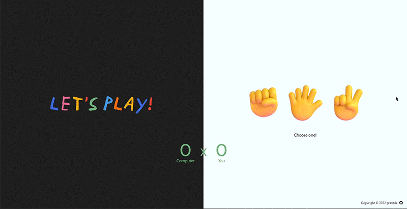

<!-- PROJECT LOGO -->
 

  

  <h3 align="center">Rock Paper Scissors</h3>

  

    A simple implementation of grade-school classic “rock paper scissors”. Part of The Odin Project's JavaScript curriculum.
     
     
    <a href="https://praxeds.github.io/theodinproject-rock-paper-scissors/">Live Demo</a>
    ·
    <a href="https://codepen.io/praxeds/pen/NWzrJXg">Codepen</a>
    ·
    <a href="https://www.theodinproject.com/">The Odin Project</a>
  

<!-- TABLE OF CONTENTS -->

  
Table of Contents

  <ol>
    <li>
      <a href="#built-with">Built With</a>
    </li>
    <li><a href="#contact">Contact</a></li>
    <li><a href="#resources">Resources</a></li>
  </ol>

### Built With

* [Github Pages](https://pages.github.com/)

(<a href="#top">back to top</a>)

<!-- CONTACT -->
## Contact

Juliana Praxedes - contact@julianapraxedes.com

Project Link: [https://github.com/praxeds/theodinproject-rock-paper-scissors](https://github.com/praxeds/theodinproject-rock-paper-scissors)

(<a href="#top">back to top</a>)

<!-- Resources -->
## Resources

* 3D Emojis by [Microsoft Teams](https://emojipedia.org/microsoft-teams/1.0/)
* Sound Effects by [Pixabay](https://pixabay.com/sound-effects)
* 'Post' Font by [Javier Guaschetti](https://www.behance.net/gallery/124785455/Post-Free-Handwritten-Font)

(<a href="#top">back to top</a>)
